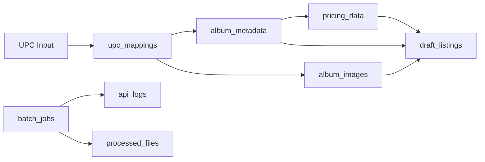

# Firestore Database Schema Documentation

## Overview

The DraftMaker application uses Google Cloud Firestore as its primary database for storing metadata, images, pricing data, and eBay listing information. The database is designed with caching, TTL policies, and optimized indexing for efficient API integrations.

**Database Details:**
- **Project ID:** draft-maker-468923
- **Database ID:** draft-maker-database  
- **Region:** us-west1

## Collections Architecture

### Collection Relationships



## Collection Specifications

### 1. upc_mappings

**Purpose:** Maps UPC codes to MusicBrainz IDs (MBID) and Discogs IDs for quick lookups.

**Document ID:** UPC code (e.g., "722975007524")

| Field | Type | Required | Description |
|-------|------|----------|-------------|
| upc | string | Yes | The UPC barcode |
| mbid | string | No | MusicBrainz Release ID |
| discogs_id | string | No | Discogs Release ID |
| created_at | timestamp | Yes | When the mapping was first created |
| updated_at | timestamp | Yes | Last update time |
| source | string | Yes | Which API provided the mapping (musicbrainz, discogs, manual) |

**Indexes:**
- Single field index on `mbid`
- Single field index on `discogs_id`

### 2. album_metadata

**Purpose:** Caches album metadata from MusicBrainz and Discogs APIs with 30-day TTL.

**Document ID:** MBID or UPC

| Field | Type | Required | Description |
|-------|------|----------|-------------|
| mbid | string | No | MusicBrainz Release ID |
| upc | string | Yes | UPC barcode |
| artist_name | string | Yes | Primary artist name |
| title | string | Yes | Album title |
| release_date | string | No | Release date (YYYY-MM-DD) |
| year | string | No | Release year |
| label_name | string | No | Record label |
| catalog_number | string | No | Label catalog number |
| format | string | No | Media format (CD, Vinyl, etc.) |
| country | string | No | Country of release |
| genres | array[string] | No | Music genres from Discogs |
| styles | array[string] | No | Music styles from Discogs |
| track_count | number | No | Total number of tracks |
| tracks | array[object] | No | Track listing with position, title, duration |
| musicbrainz_data | map | No | Raw MusicBrainz API response |
| discogs_data | map | No | Raw Discogs API response |
| metadata_sources | array[string] | Yes | Which APIs provided data |
| is_complete | boolean | Yes | Whether minimum required fields are present |
| cached_at | timestamp | Yes | When data was cached |
| ttl | timestamp | Yes | Expiration time (30 days from cached_at) |

**Indexes:**
- Composite index on `artist_name` + `title`
- Single field index on `upc`
- Single field index on `ttl`

### 3. album_images

**Purpose:** Caches album artwork from Cover Art Archive and Spotify with 30-day TTL.

**Document ID:** MBID or UPC

| Field | Type | Required | Description |
|-------|------|----------|-------------|
| identifier | string | Yes | MBID or UPC used as identifier |
| identifier_type | string | Yes | Type of identifier (mbid, upc) |
| cover_art_archive | array[object] | No | Images from Cover Art Archive |
| spotify_images | array[object] | No | Images from Spotify API |
| primary_image_url | string | No | Best quality front cover image |
| thumbnail_url | string | No | Thumbnail for quick display |
| ebay_url | string | No | Optimized image URL for eBay listings |
| sources | array[string] | Yes | Which APIs provided images |
| cached_at | timestamp | Yes | When images were cached |
| ttl | timestamp | Yes | Expiration time (30 days from cached_at) |

**Image Object Structure:**
```json
{
  "url": "string",
  "thumbnail_500": "string",
  "thumbnail_250": "string", 
  "width": "number",
  "height": "number",
  "is_front": "boolean",
  "is_back": "boolean",
  "types": ["Front", "Back"],
  "approved": "boolean"
}
```

**Indexes:**
- Composite index on `identifier_type` + `identifier`
- Single field index on `ttl`

### 4. pricing_data

**Purpose:** Stores eBay sold listing prices and market analytics with 7-day TTL.

**Document ID:** Composite key: `{upc}_{condition}_{timestamp}`

| Field | Type | Required | Description |
|-------|------|----------|-------------|
| upc | string | Yes | UPC barcode |
| title | string | No | Album title for reference |
| artist | string | No | Artist name for reference |
| condition | string | Yes | Item condition (New, Like New, Very Good, Good, Acceptable, Used) |
| average_price | number | No | Average sold price |
| median_price | number | No | Median sold price |
| min_price | number | No | Minimum sold price |
| max_price | number | No | Maximum sold price |
| recommended_price | number | No | Algorithm-recommended listing price |
| sample_size | number | Yes | Number of sold items analyzed |
| confidence | string | Yes | Confidence level (high, medium, low, none) |
| price_strategy | string | No | Strategy used (competitive, median, conservative, default) |
| currency | string | Yes | Currency code (default: USD) |
| search_method | string | No | How pricing was found (upc, artist_album, album_only) |
| date_range_start | timestamp | Yes | Start of date range for sold items |
| date_range_end | timestamp | Yes | End of date range for sold items |
| sample_listings | array[object] | No | Sample of actual sold listings |
| cached_at | timestamp | Yes | When pricing was cached |
| ttl | timestamp | Yes | Expiration time (7 days from cached_at) |

**Subcollection: `history`**
- Stores individual sold listing records
- Fields: item_id, title, price, condition, end_time, listing_type, url

**Indexes:**
- Composite index on `upc` + `condition` + `cached_at` (DESC)
- Single field index on `ttl`

### 5. oauth_tokens

**Purpose:** Stores OAuth tokens for Spotify and eBay APIs with encryption.

**Document ID:** Service name (spotify, ebay)

| Field | Type | Required | Description |
|-------|------|----------|-------------|
| service | string | Yes | Service name (spotify, ebay) |
| access_token | string | Yes | Encrypted access token |
| refresh_token | string | No | Encrypted refresh token |
| expires_at | timestamp | Yes | Token expiration time |
| scope | array[string] | No | OAuth scopes granted |
| token_type | string | Yes | Type of token (default: Bearer) |
| created_at | timestamp | Yes | When token was created |
| updated_at | timestamp | Yes | Last update time |
| last_refreshed | timestamp | No | Last refresh attempt |

**Security Note:** Consider using Google Secret Manager instead of direct Firestore storage for tokens.

### 6. draft_listings

**Purpose:** Tracks eBay draft listings created through the Sell API.

**Document ID:** eBay offer ID or SKU

| Field | Type | Required | Description |
|-------|------|----------|-------------|
| offer_id | string | No | eBay offer ID |
| sku | string | Yes | Stock keeping unit (CD_{upc}_{timestamp}) |
| upc | string | Yes | UPC barcode |
| title | string | Yes | Listing title |
| artist | string | No | Artist name |
| album | string | No | Album title |
| condition | string | Yes | Item condition (default: USED_VERY_GOOD) |
| price | number | Yes | Listing price |
| currency | string | Yes | Currency code (default: USD) |
| quantity | number | Yes | Available quantity (default: 1) |
| category_id | string | Yes | eBay category ID (default: 176984) |
| listing_format | string | Yes | Listing format (default: FIXED_PRICE) |
| status | string | Yes | Status (draft, published, sold, ended, deleted) |
| primary_image_url | string | No | Main listing image |
| fulfillment_policy_id | string | Yes | eBay fulfillment policy |
| payment_policy_id | string | Yes | eBay payment policy |
| return_policy_id | string | Yes | eBay return policy |
| created_at | timestamp | Yes | When draft was created |
| updated_at | timestamp | Yes | Last update time |
| published_at | timestamp | No | When listing was published |
| ended_at | timestamp | No | When listing ended |
| ebay_item_id | string | No | eBay item ID after publishing |
| listing_url | string | No | Live listing URL |
| metadata | map | No | Additional eBay-specific fields |

**Indexes:**
- Composite index on `status` + `created_at` (DESC)
- Single field index on `upc`
- Single field index on `sku`

### 7. batch_jobs

**Purpose:** Tracks batch processing jobs and their status.

**Document ID:** Auto-generated

| Field | Type | Required | Description |
|-------|------|----------|-------------|
| job_id | string | Yes | Unique job identifier |
| type | string | Yes | Job type (metadata_fetch, image_fetch, pricing_fetch, draft_creation, full_pipeline) |
| status | string | Yes | Status (pending, processing, completed, failed, cancelled) |
| total_items | number | Yes | Total number of items to process |
| processed_items | number | Yes | Number of items processed |
| successful_items | number | Yes | Number of successful items |
| failed_items | number | Yes | Number of failed items |
| input_source | string | No | Source of input data (GCS path or local file) |
| input_data | array[string] | Yes | List of UPCs or identifiers to process |
| results_summary | map | No | Summary of processing results |
| error_log | array[object] | No | Log of errors encountered |
| processing_time_seconds | number | No | Total processing time |
| started_at | timestamp | No | Job start time |
| completed_at | timestamp | No | Job completion time |
| created_at | timestamp | Yes | Job creation time |
| created_by | string | No | User or system that created the job |

**Subcollection: `items`**
- Tracks individual item processing status
- Fields: item_id, upc, status, metadata_fetched, images_fetched, pricing_fetched, draft_created, error, processed_at

**Indexes:**
- Composite index on `type` + `status` + `created_at` (DESC)
- Composite index on `created_by` + `created_at` (DESC)

### 8. api_logs

**Purpose:** Logs all API calls, responses, and errors for monitoring.

**Document ID:** Auto-generated

| Field | Type | Required | Description |
|-------|------|----------|-------------|
| api_name | string | Yes | API name (musicbrainz, discogs, cover_art_archive, spotify, ebay_finding, ebay_sell) |
| endpoint | string | Yes | API endpoint called |
| method | string | Yes | HTTP method (GET, POST, PUT, DELETE, PATCH) |
| request_params | map | No | Request parameters sent |
| request_body | map | No | Request body for POST/PUT requests |
| response_status | number | Yes | HTTP response status code |
| response_time_ms | number | Yes | Response time in milliseconds |
| response_size_bytes | number | No | Size of response in bytes |
| success | boolean | Yes | Whether the API call was successful |
| error_message | string | No | Error message if failed |
| error_type | string | No | Type of error (timeout, rate_limit, auth_error, not_found, server_error, client_error) |
| batch_job_id | string | No | Associated batch job ID |
| upc | string | No | UPC being processed |
| timestamp | timestamp | Yes | When the API call was made |
| ttl | timestamp | Yes | Expiration (7 days for success, 30 days for errors) |

**Indexes:**
- Composite index on `api_name` + `timestamp` (DESC)
- Single field index on `batch_job_id`
- Composite index on `success` + `timestamp` (DESC)
- Single field index on `ttl`

### 9. processed_files

**Purpose:** Tracks files that have been processed to avoid duplicates.

**Document ID:** File path or GCS URI

| Field | Type | Required | Description |
|-------|------|----------|-------------|
| file_path | string | Yes | Full path or GCS URI of the file |
| file_name | string | Yes | File name |
| source_type | string | Yes | Source type (gcs, local, upload) |
| total_upcs | number | Yes | Total UPCs in file |
| valid_upcs | number | Yes | Valid UPCs found |
| processed_upcs | number | Yes | UPCs successfully processed |
| batch_job_id | string | No | Associated batch job ID |
| processed_at | timestamp | Yes | When file was processed |
| processing_time_seconds | number | No | Time taken to process |
| status | string | Yes | Processing status (completed, partial, failed) |

**Indexes:**
- Composite index on `source_type` + `processed_at` (DESC)

## Security Rules

All collections are protected by security rules that only allow access from authorized service accounts:

1. **draft-maker-identity** (UID: 117616124807389754852) - Full read/write access
2. **github-actions** (UID: 100850421393398263519) - Read-only access (except OAuth tokens)

OAuth tokens and API tokens collections have additional restrictions - only the main service account can access them.

## TTL Policies

| Collection | TTL Duration | Purpose |
|------------|--------------|---------|
| album_metadata | 30 days | Refresh metadata monthly |
| album_images | 30 days | Refresh images monthly |
| pricing_data | 7 days | Keep pricing current |
| api_logs (success) | 7 days | Recent successful calls |
| api_logs (errors) | 30 days | Error analysis |

## Query Patterns

### Common Queries

1. **Find MBID by UPC:**
```javascript
db.collection('upc_mappings').doc(upc).get()
```

2. **Get album metadata:**
```javascript
db.collection('album_metadata').doc(mbid).get()
```

3. **Get latest pricing for UPC:**
```javascript
db.collection('pricing_data')
  .where('upc', '==', upc)
  .where('condition', '==', 'Very Good')
  .orderBy('cached_at', 'desc')
  .limit(1)
  .get()
```

4. **List draft listings:**
```javascript
db.collection('draft_listings')
  .where('status', '==', 'draft')
  .orderBy('created_at', 'desc')
  .get()
```

5. **Monitor API errors:**
```javascript
db.collection('api_logs')
  .where('success', '==', false)
  .orderBy('timestamp', 'desc')
  .limit(100)
  .get()
```

## Backup Strategy

- **Frequency:** Daily automated backups
- **Retention:** 30 days
- **Storage:** gs://draft-maker-bucket/firestore-backups
- **Method:** Google Cloud scheduled exports

## Migration Guidelines

When updating the schema:

1. Update `firestore-schema.json` with new fields/collections
2. Create migration script in `scripts/firestore/migrations/`
3. Test migration in development environment
4. Deploy new indexes if required
5. Run migration during maintenance window
6. Update this documentation

## Deployment

### Initial Setup

```bash
# Install Firebase CLI
npm install -g firebase-tools

# Login to Firebase
firebase login

# Initialize Firestore in project
firebase init firestore

# Deploy security rules
firebase deploy --only firestore:rules

# Deploy indexes
firebase deploy --only firestore:indexes
```

### Initialize Database

```bash
# Run initialization script
python scripts/firestore/initialize_database.py
```

## Monitoring

Key metrics to monitor:

- Document read/write rates per collection
- TTL expiration processing
- Index usage patterns
- Storage usage growth
- API error rates in api_logs

## Best Practices

1. **Always use indexed queries** - Avoid collection scans
2. **Implement proper TTL** - Clean up stale data automatically
3. **Batch writes** - Use batch operations for multiple documents
4. **Cache in application** - Reduce Firestore reads
5. **Monitor costs** - Track document operations
6. **Regular backups** - Ensure data recovery capability

## Support

For database issues or schema updates, contact the development team or create an issue in the project repository.
